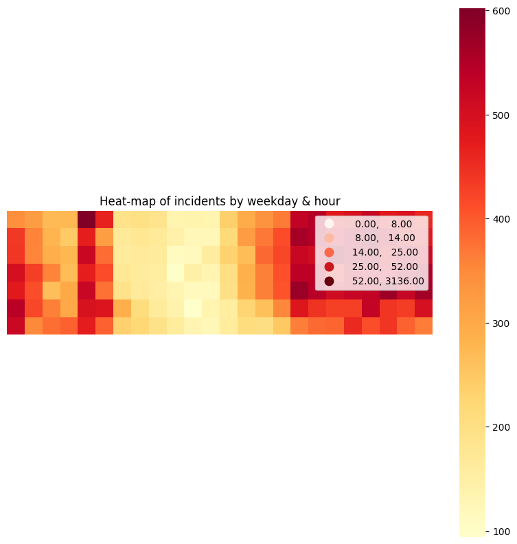

PconnorsUWO: @workspace Rewrite this readme based on my workspace

Workspace: Collecting workspace informationFiltering to most relevant information# yorkregion_crime_analysis
Exploratory analysis of contributing socioeconomic factors to crime within the York region.

## Overview
This repository contains a project that investigates the relationship between neighborhood safety and a range of socio-economic factors in York Region. The work is comprised of two main files:

1. analysis.ipynb  
   • Implements data loading, cleaning, plotting, and logistic-regression modeling in Python.  
   • Displays visualizations such as maps showing dissemination areas, crime incidence, and safety scores.  
   • Uses both crime data and dissemination area shapefiles to spatially join crime data with Census boundaries.

2. latex_code.tex  
   • Provides the final compiled report in LaTeX format.  
   • Imports references from references.bib and shows how the final paper is structured.  
   • Contains tables, figures, and commentary about data, methodology, and findings.

## Data Sources and Citations
All external datasets are cited throughout the repository and in the LaTeX sources. Key references include:
- York Regional Police crime data
- Statistics Canada census guidelines and Dissemination Area definitions

Other statistical files (e.g., socio-economic data) are obtained from the York Region Open Data Portal (2016 and 2021 Census data). Detailed references are collected in the references.bib file.

## Major Findings
1. **Crime Hotspots**: The spatial join (shown in the figures within the Jupyter notebook) highlights certain Dissemination Areas with higher weighted "SAFETY_SCORE."  
2. **Socio-Economic Correlations**: Higher median incomes correlated with some types of offenses—possibly due to reporting patterns or property-related crimes.  
3. **Logistic Regression Accuracy**: Achieved ~71.5% test-set accuracy in predicting whether an area is "Safer" or "Less Safe."  
4. **Key Drivers**: Variables like unemployment rate and migration rate had moderate associations with local safety levels.

Below is an example map from the analysis, illustrating crime counts per Dissemination Area. Refer to the notebook for details:

To see further plots (e.g., demographic comparisons and regression outputs), open the Jupyter Notebook analysis.ipynb.

## How to Use
1. **Data Analysis**:  
   • Place the shapefile (dissemination.shp and related files) and CSV datasets in the data folder.  
   • Run the Python code in analysis.ipynb using a Jupyter environment to generate figures and model outputs.

2. **LaTeX Report**:  
   • Compile latex_code.tex with a LaTeX distribution supporting `biber` for references.  
   • The compiled PDF (latex_code.pdf) contains an academic-style write-up and data references.

## License & Disclaimer
• This work uses public data from the York Region Open Data Portal, which may have its own license or usage terms.  
• The logistic-regression model is for academic demonstration only and should not be used for critical decision-making without further validation.

Feel free to clone or download this repository for educational purposes. For any issues or questions, open an issue on GitHub or contact the author.

PconnorsUWO: @workspace  more graphs from my figures I want almost all of them with some expository information on them 

Workspace: Collecting workspace information# yorkregion_crime_analysis
Exploratory analysis of contributing socioeconomic factors to crime within the York region.

## Overview
This repository contains a project that investigates the relationship between neighborhood safety and a range of socio-economic factors in York Region. The work is comprised of two main files:

1. analysis.ipynb  
   • Implements data loading, cleaning, plotting, and logistic-regression modeling in Python.  
   • Displays visualizations such as maps showing disseminations areas, crime incidence, and safety scores.  
   • Uses both crime data and dissemination area shapefiles to spatially join crime data with Census boundaries.

2. latex_code.tex  
   • Provides the final compiled report in LaTeX format.  
   • Imports references from references.bib and shows how the final paper is structured.  
   • Contains tables, figures, and commentary about data, methodology, and findings.

## Data Sources and Citations
All external datasets are cited throughout the repository and in the LaTeX sources. Key references include:
- York Regional Police crime data  
- Statistics Canada census guidelines and DA definitions

Other statistical files (e.g., socio-economic data) are obtained from the York Region Open Data Portal (2016 and 2021 Census data). Detailed references are collected in the references.bib file.

## Major Findings
1. **Crime Hotspots**: The spatial join highlights certain Dissemination Areas with higher weighted "SAFETY_SCORE."  
2. **Socio-Economic Correlations**: Higher median incomes correlated with some types of offenses—possibly due to reporting patterns or property-related crimes.  
3. **Logistic Regression Accuracy**: Achieved ~71.5% test-set accuracy in predicting whether an area is "Safer" or "Less Safe."  
4. **Key Drivers**: Variables like unemployment rate and migration rate had moderate associations with local safety levels.

## Data Visualization and Analysis

### Crime Distribution by Area

This map visualizes crime counts across York Region's Dissemination Areas, revealing concentration patterns. Areas with darker colors represent higher crime incidence.

### Safety Score Distribution

This visualization shows the mean Safety Score by DA in York Region, where areas with higher scores (darker colors) indicate lower safety levels based on our weighted crime severity index.

### Socioeconomic Factor Analysis

This plot compares demographic variables between areas classified as "safer" vs. "less safe," showing significant differences in median income levels.

Migration rates show notable differences between safer and less safe areas, potentially indicating population stability's role in community safety.

This visualization examines how housing costs relate to safety classifications across different York Region communities.

### Model Results

This chart displays the relative importance of each socioeconomic variable in predicting area safety levels. Unemployment rate shows the strongest correlation with safety outcomes.

Our logistic regression model achieved approximately 71.5% accuracy in predicting safety classifications, with this confusion matrix showing true vs. predicted outcomes.

This map compares actual vs. predicted safety classifications across York Region, with green areas showing correct predictions and red areas showing misclassifications.

## How to Use
1. **Data Analysis**:  
   • Place the shapefile and related files and CSV datasets in the data folder.  
   • Run the Python code in analysis.ipynb using a Jupyter environment to generate figures and model outputs.

2. **LaTeX Report**:  
   • Compile latex_code.tex with a LaTeX distribution supporting `biber` for references.  
   • The compiled PDF contains an academic-style write-up and data references.

## License & Disclaimer
• This work uses public data from the York Region Open Data Portal, which may have its own license or usage terms.  
• The logistic-regression model is for academic demonstration only and should not be used for critical decision-making without further validation.

Feel free to clone or download this repository for educational purposes. For any issues or questions, open an issue on GitHub or contact the author.